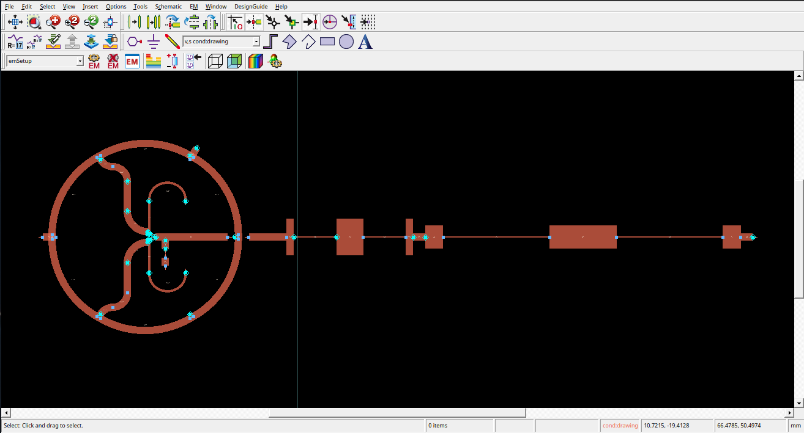

# Projeto e implementação de radares em micro-ondas

Esse repositório contém artefatos da disciplina **PSI5844: Projeto e implementação de radares em micro-ondas** da Universidade de São Paulo. A turma se dividiu em duplas para projetar diferentes componentes de um radar FMCW. Nesse repositório, está presente o projeto do [misturador de frequências](https://en.wikipedia.org/wiki/Frequency_mixer).

As etapas de projeto, design, simulação e layout foram feitas no [KeySight ADS](https://www.keysight.com/br/pt/products/software/pathwave-design-software/pathwave-advanced-design-system.html) utilizando uma licença universitária. Um arquivo **.7zads** contendo a workspace arquivada com os layouts utilizados para fabricação e esquemáticos de teste está disponível nesse repositório.

O repositório contém slides utilizados para a apresentação de defesa, assim como um documento intermediário contendo um estudo inicial de diferentes topologias de misturadores de frequência. A [pasta *img* nesse repositório](https://github.com/ArkhamKnightGPC/fmcw-radar/blob/main/img) contém imagens dos circuitos fabricados e da bancada de testes durante a coleta das medidas para o relatório.

