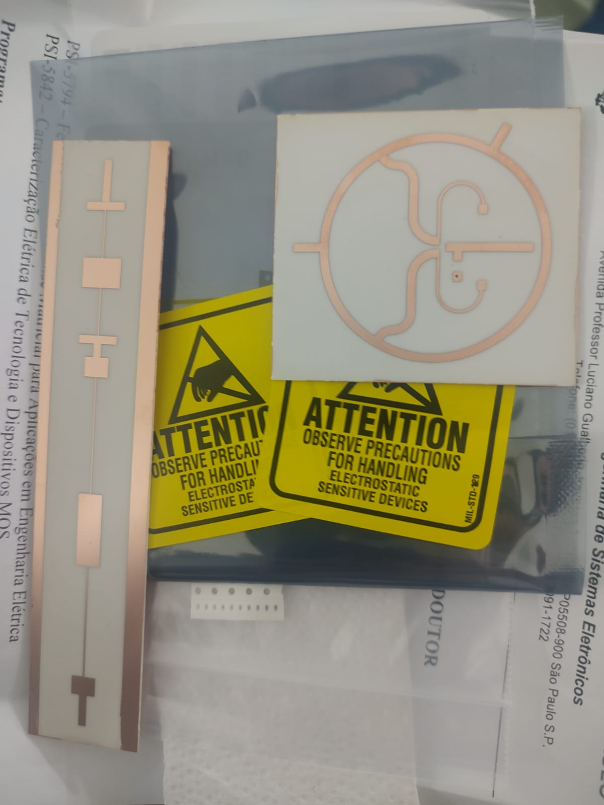
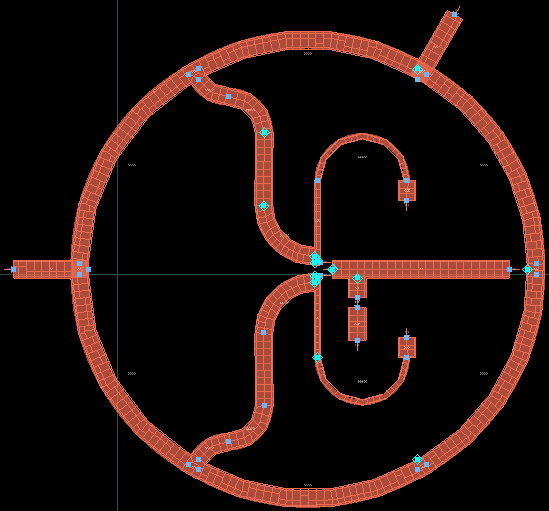
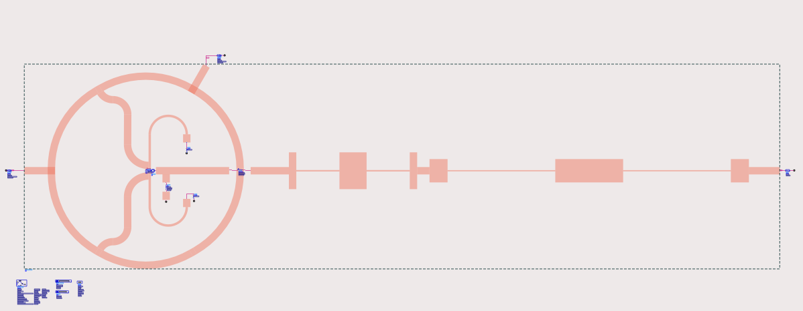

# Projeto e implementação de radares em micro-ondas

Esse repositório contém artefatos da disciplina **PSI5844: Projeto e implementação de radares em micro-ondas** da Universidade de São Paulo. Nesse repositório, está presente o projeto do [misturador de frequências](https://en.wikipedia.org/wiki/Frequency_mixer) constituído por um [acoplador rat-race](https://en.wikipedia.org/wiki/Rat-race_coupler) e um [filtro passa-baixas de microfita](https://en.wikipedia.org/wiki/Distributed-element_filter#Low-pass_filters).

As etapas de projeto, design, simulação e layout foram feitas no [KeySight ADS](https://www.keysight.com/br/pt/products/software/pathwave-design-software/pathwave-advanced-design-system.html) utilizando uma licença universitária. Um arquivo **.7zads** contendo a workspace arquivada com os layouts utilizados para fabricação e esquemáticos de teste está disponível nesse repositório.

O [plano de testes presente nesse repositório](https://github.com/ArkhamKnightGPC/fmcw-radar/blob/main/plano_de_testes_GabrielHeitor.pdf) apresenta métricas dos circuitos projetos e resultados de simulação que foram utilizados para comparação com testes feitos em laboratório com os circuitos fabricados.

## Galeria de imagens

